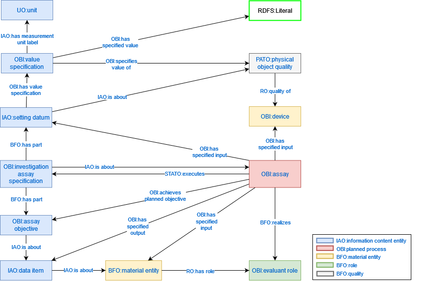

# Design Patterns & Decisions
 
**This page will be updated regularly in the iterative development of VIBSO to document modeling decisions and design patterns.**

Following best practices in ontology development, we will reuse established design patterns whenever possible. Since most ontologies we reuse are OBO Foundry based, we also reuse their design patterns to be logically sound and interoperable. Some of these patterns are provided in the formal definitions of the classes we reuse in form of asserted as `rdfs:subclassOf` or `rdfs:equivalentTo` axioms. Others are only implicitly provided in the textual definitions and the domain and range restriction of suitable OBO relations.

## VIBSO TBox

Here you can see VIBSO's current terminology box that focuses on vibrational Raman spectroscopy and which also shows how VIBSO depends on reusing existing ontology classes, relations and design patterns.

This TBox is supposed to be updated iteratively whenever a new term is being discussed for inclusion. We hope that it might be easier for domain experts to define technical terms in this ontological framework by adding them here first.

An HTML version with links to the used classes in the NFDI4Chem Terminology Service can be found [here](images/VIBSO_TBox_graph_views.html).

The source file to edit the TBox with the [draw.io](https://draw.io) app is [here](images/VIBSO_T-Box_graph_views.drawio).

## Assay Pattern
As the scope of VIBSO covers the definitions of various types of vibrational spectroscopy assays and their specific research information outputs, we need to reuse the class `assay` from the Ontology for Biomedical Investigations (OBI). It is defined as:

     A planned process that has the objective to produce information about a material entity (the evaluant) by examining it.

Along with this textual definition, the logical axioms asserted on this class constitute a core design pattern of OBO based ontologies, which can be represented graphically like this:

## Assay Pattern with Device Settings
Since we also want to say what kind of devices were used in VIBSO specific assays and how these were set, we extend the assay pattern by importing these classes and relations:

## Assay Pattern with Data Transformation, Investigation and Sampling
To zoom out a bit further, this is the pattern proposed to be able to also express:

* who performed an assay,
* what kind of data transformations where performed on the data output of an assay,
* what kind of sampling process was done before the assay,
* and in which grander investigation process the assay is a part of.

-----

## Measurement Example KG of the Assay Pattern
Lars Vogt and Tobias Kuhn demonstrate the use of the OBO assay pattern within a grander research context as follows (cited from their preprint [DOI:10.13140/RG.2.2.13742.59203](http://doi.org/10.13140/RG.2.2.13742.59203), p.8):

 > Figure 3: A detailed machine-actionable representation of the metadata relating to a weight measurement datum documented as an RDF ABox graph. The representation takes the form of an ABox semantic graph following the RDF syntax. The graph documents a mass measurement process using a balance. It relates an instance of mass measurement assay (OBI:0000445) with instances of various other classes from different ontologies, specifying who conducted the measurement, where and when it took place, following which protocol and using which device (i.e., balance). The graph furthermore specifies the particular material entity that served as subject and thus as input of the measurement process (i.e., ‘objectX’), and it specifies the data that is the output of the observation, which is contained in a particular weight measurement assertion.

## Quality & Quantity Pattern

 Since we are reusing OBO ontologies and their patterns, we also try to reuse OBI's way of modeling [data and values](https://github.com/obi-ontology/obi/wiki/Data-and-Values). Please read their documentation for more background.
 Using this OBI pattern allows us to differentiate data values of qualities (aka attributes) of a material entity, such as the spectroscope or sample, into data values that represent settings and those that represent measurements. From a data repository use case perspective, we might not need this fine-grained approach and defining qualities/attributes and their value specifications might suffice. Yet in order to allow the integration of VIBSO in Electronic Lab Notebooks, such a differentiation will most likely be very useful.
Although this pattern seems to work in many OBO use cases, we need to see, if we have to adjust it for our needs. Other ontologies like QUDT or SIO are using slightly different pattern to model qualities and their quantitative representations.