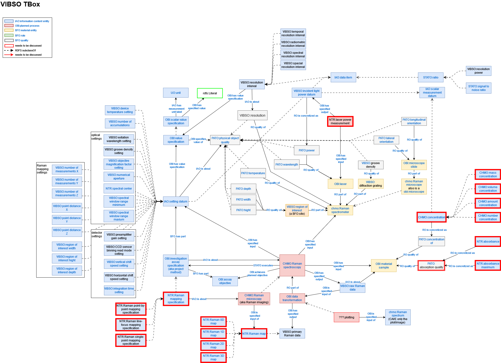
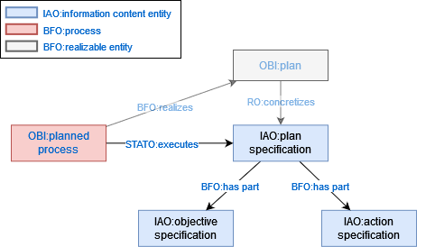
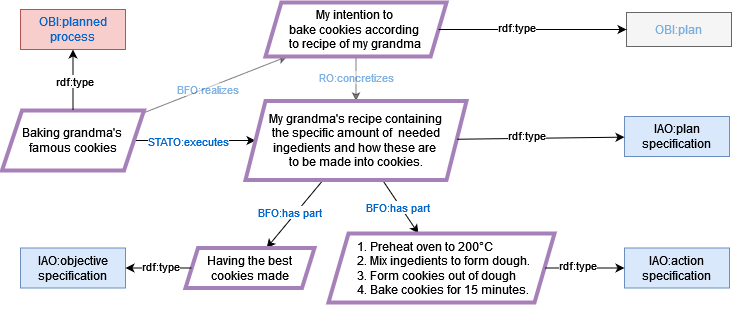
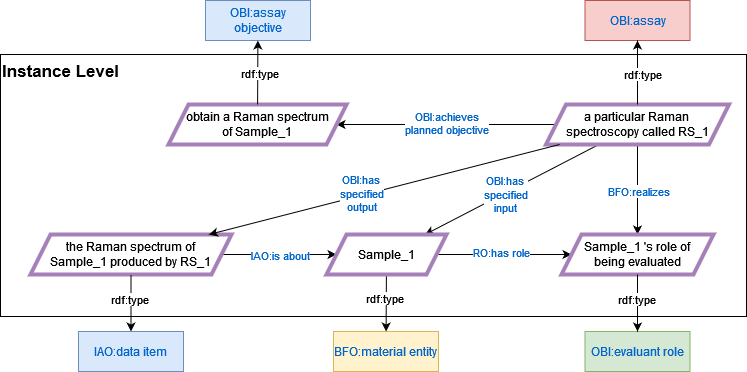
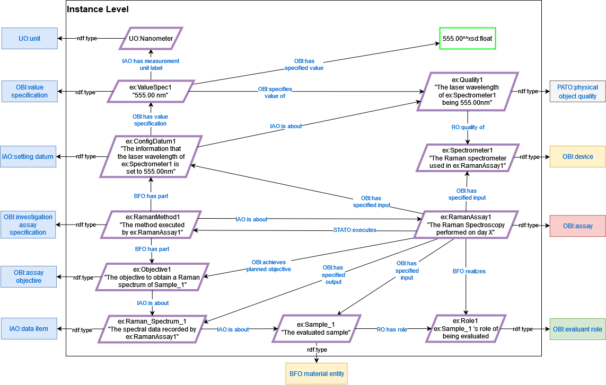

# Design Patterns & Decisions
 
**This page will be updated regularly in the iterative development of VIBSO to document modeling decisions and design 
patterns.**

Following best practices in ontology development, we will reuse established design patterns whenever possible. 
Since most ontologies we reuse are OBO Foundry based, we also reuse their design patterns to be logically sound and 
interoperable. This entails committing to its underlying ontological framework, which is on the most abstract level
grounded in the Basic Formal Ontology (BFO) 2.0 classes only version and the current version of the Relation Ontology 
(RO).
These patterns are expressed formally in the logical definitions of the imported classes in form of asserted
`rdfs:equivalentTo` or `rdfs:subclassOf` axioms and in the logical definitions of the imported properties in form of 
asserted `rdfs:domain` and `rdfs:range` axioms and their type (e.g. transitive, functional, symmetric, etc.). 
Although less formally binding, the textual definitions of the classes and relations constituting these pattern are 
also part of their expression.

## VIBSO TBox

Here you can see VIBSO's current terminology box (TBox) that focuses on vibrational Raman spectroscopy and 
which also shows how VIBSO depends on reusing existing ontology classes, relations and design patterns.

This TBox is supposed to be updated iteratively whenever a new term is being discussed for inclusion. 
We hope that it might be easier for domain experts to define technical terms in this ontological framework by adding 
them here first.

A higher resolution HTML version of this TBox and the below discussed pattern graphs with links to the used terms in 
the NFDI4Chem Terminology Service can be found [here](images/VIBSO_TBox_graph_views.html). The source file to edit these with the [draw.io](https://draw.io) app 
is [here](images/VIBSO_T-Box_graph_views.drawio).

## Planned Process Pattern
Within the above TBox we can find specializations of a central class defined in the Ontology for Biomedical 
Investigations (OBI) which is called ['planned proces'](https://terminology.nfdi4chem.de/ts/ontologies/vibso/terms?iri=http%253A%252F%252Fpurl.obolibrary.org%252Fobo%252FOBI_0000011).
This class is central in the OBO framework because it provides a general pattern for defining all kinds of processes in 
which some agent(s) act(s) according to a set of predetermined instructions in order to achieve a certain outcome. 
Logically, it is defined as a "process that realizes a plan which is the concretization of a plan specification". 
Following the formalization of this definition, we can safely ignore the very abstract 'plan' class and only need to 
focus on the ['plan specification'](https://terminology.nfdi4chem.de/ts/ontologies/vibso/terms?iri=http%253A%252F%252Fpurl.obolibrary.org%252Fobo%252FIAO_0000104) 
that gets concretized by a 'plan'. A 'plan specification' is defined in the Information Artifact Ontology (IAO) as the 
directive information that specifies through its parts which actions have to be performed (['action specification'](https://terminology.nfdi4chem.de/ts/ontologies/vibso/terms?iri=http%253A%252F%252Fpurl.obolibrary.org%252Fobo%252FIAO_0000007))
in order to achieve the intended goals (['objective specification'](https://terminology.nfdi4chem.de/ts/ontologies/vibso/terms?iri=http%253A%252F%252Fpurl.obolibrary.org%252Fobo%252FIAO_0000005))
of a 'planned process'. It thus resembles more fittingly what we usually mean in natural language when speaking of a 
plan or method. To have a direct relation from a plan specification to its planned process, we can reuse 
'executes' from the Statistical Methods Ontology (STATO), as it is defined exactly for this purpose.

The pattern can be visualized like this:

We could apply this very general pattern for example to describe the baking of cookies like this:

## OBI Core Assay Pattern
As defining all relevant types of vibrational spectroscopy assays, including their different kinds of data outputs 
and their experimental setups from a research data management perspective is the central goal of VIBSO, we are 
always dealing with special kinds of planned processes. For this we can leverage the fact that there also already 
exists an ['assay'](https://terminology.nfdi4chem.de/ts/ontologies/vibso/terms?iri=http%253A%252F%252Fpurl.obolibrary.org%252Fobo%252FOBI_0000070) 
class within OBI, which we can reuse as the central parent class for all vibrational spectroscopy assays. 
It is defined as:

     A planned process that has the objective to produce information 
     about a material entity (the evaluant) by examining it.

This definition, along with the logical axioms asserted on this class and their entailments, constitute a core 
design pattern which can be represented graphically like this:

To exemplify this pattern within the domain of VIBSO we can instantiate these classes like this.

To better understand the defined logic of this pattern, it seems useful to look at its part more closely.

### Subjects of an Assay
As we can see in this graph, the use of the term 'assay' is restricted to only those planned processes that examine a 
['material entity'](https://terminology.nfdi4chem.de/ts/ontologies/vibso/terms?iri=http%3A%2F%2Fpurl.obolibrary.org%2Fobo%2FBFO_0000040) via the ['has specified input'](https://terminology.nfdi4chem.de/ts/ontologies/vibso/props?iri=http%3A%2F%2Fpurl.obolibrary.org%2Fobo%2FOBI_0000293) relation. A material entity is defined in BFO as anything 
that is extended in three-dimensional space, has a unique identity and contains some portion of matter. This could 
include objects identified by their mass, material boundaries, or energy. Therefore, a rock, a nostril, or an elementary 
particle such as an electron or quark, all qualify as a material entity. This restriction on the meaning of assay is not 
just given in the above definition, but also in the definitions of ['assay objective'](https://terminology.nfdi4chem.de/ts/ontologies/vibso/terms?iri=http%3A%2F%2Fpurl.obolibrary.org%2Fobo%2FOBI_0000441) and ['evaluant role'](https://terminology.nfdi4chem.de/ts/ontologies/vibso/terms?iri=http%3A%2F%2Fpurl.obolibrary.org%2Fobo%2FOBI_0000441). 
Therefore, a planned process which examines a thing that is not a material entity cannot be classified as an assay in 
this sense, its role can never be an 'evaluant role' and its objective can never be an 'assay objective'.

### Outputs of an Assay
When looking at the output of an 'assay', we see that, although its textual definition only speaks of information in 
general, the axiomatization in this pattern rather restricts the possible output to ['data item'](https://terminology.nfdi4chem.de/ts/ontologies/vibso/terms?iri=http%3A%2F%2Fpurl.obolibrary.org%2Fobo%2FOBI_0000441), a special kind 
of information, via the ['has specified output'](https://terminology.nfdi4chem.de/ts/ontologies/vibso/terms?iri=http%3A%2F%2Fpurl.obolibrary.org%2Fobo%2FOBI_0000441) 
relation. The 'data item' class is defined in IAO as a kind of information "that is intended to be a truthful 
statement about something [...] and is constructed/acquired by a method which reliably tends to produce (approximately) 
truthful statements." Although this definition might suggest otherwise, an editor note on this class and the synonym 
'data' make clear that 'data item' also includes the kinds of information that are compositions of multiple truthful 
statements about a thing. In the context of the 'assay' pattern, we can thus say that an 'assay' must produce a truthful
statement or a composition of truthful statements about the examined 'material entity'. To apply this to an example from 
VIBSO's domain, we can say that a Raman spectrum is a 'data item' because it is composed of the measurements (e.g. 
scattered light intensity values) that were recorded during a Raman spectroscopy assay.

### Defining an Assay according to this Pattern
There is an axiom asserted on the assay class which states that whenever an 'assay objective' is achieved by the use of 
a planned process, this process must be classified as an 'assay'. Hence, the 'assay objective' must be the information 
that describes the assay type by specifying what kind of data about the evaluated material is to be produced. 
Accordingly, the definition of 'assay objective' reads: "an objective specification to determine a specified type of 
information about an evaluated entity (the material entity bearing evaluant role)". However, ['analyte measurement 
objective'](https://terminology.nfdi4chem.de/ts/ontologies/obi/terms?iri=http%253A%252F%252Fpurl.obolibrary.org%252Fobo%252FOBI_0000437)
seems to be the only subclass of 'assay objective' in OBO ontologies, and it is only used to group roughly 600 kinds of 
assays as an 'analyte assay', which produces information about the presence, concentration, or amount of a 
molecular entity or an atom, within the evaluated material. These analyte assays themselves are formally stratified 
mostly by specifying which kind of molecular entity or atom is being analysed within the evaluated material. The 
remaining 1000+ specializations of assay in OBI are formally stratified either by focusing on the evaluated material, 
a certain characteristic of the evaluated material, the specific kind of data output, the devices used, or a 
combination of these. 

This shows that we can use various axis of differentiation within the core assay pattern to classify a specific 
kind of assay. Using logical axioms in the formal definition of assay types helps alot, as it allows multiple 
inheritance to be inferred automatically by reasoners, an example of which is
['3D molecular structure determination assay of an antigen:antibody complex'](https://terminology.nfdi4chem.de/ts/ontologies/obi/terms?iri=http%253A%252F%252Fpurl.obolibrary.org%252Fobo%252FOBI_0001721).
What some assay definitions in OBI also indicate is that we sometimes need to extend the core OBI assay pattern 
to classify certain assay types. Especially, if we want to differentiate or group assays in more detail, like when we 
need more information about the used method including the devices and device settings.
 
## Extending the OBI Core Assay Pattern
Since 'assay' is a specialization of 'planned process', we know that its method must be 
a kind of 'plan specification'. In OBI, we find the class 'investigation assay specification', which is defined as a 
'plan specification' about an assay that indicates the assay type, and which also called 'Project Method'. Some provided 
examples for this class are: sequence or mass spectrometry. Hence, we can say that the 'assay objective' is an 
essential part of this class. Similarly, we can say that the information which determines the essential experimental 
setup of a specific assay, such as the needed devices and device settings, must also be an essential part of the 
'investigation assay specification'.

### Assay Devices
To represent the instruments used in an assay, we can import the already existing 'device' class from OBI and link 
it to 'assay' via the 'has specified input' relation. The definition of this relation makes clear that the range of it, 
in our case a 'device', must be specified in a 'plan specification', in our case an 'investigation assay specification'.

### Device Settings 
Representing the device settings of an assay is a bit more complex. From IAO, we can use the class ['setting datum'](https://terminology.nfdi4chem.de/ts/ontologies/vibso/terms?iri=http%253A%252F%252Fpurl.obolibrary.org%252Fobo%252FIAO_0000140), 
to represent the part of an 'investigation assay specification' that is about the device setting, since it is defined 
as a 'data item' "that denotes some configuration of an instrument". We can thus also link it directly to an 
'assay' via the 'is specified input' relation. What we need to represent next in this extended pattern is the 
relation between the 'setting datum' and the characteristic of the assay device that it determines. As a 
'device' is a material entity, its configurable characteristics can be represented with the class ['physical object 
quality'](https://terminology.nfdi4chem.de/ts/ontologies/vibso/terms?iri=http%3A%2F%2Fpurl.obolibrary.org%2Fobo%2FPATO_0001241), 
which we can import from the Phenotype and Trait Ontology (PATO). It is the parent class of more specific physical 
characteristics, such as temperature, wavelength, mass or position, and it can be related to the device via the 
'quality of' relation from BFO. To be able to say that a 'setting datum' determines the value of such a device 
characteristic, we can use the RO relation 'causally influences'. 

Since the actual quantitative value specified in a 'setting datum' can be encoded using different units of measurement,
we also need a way to formally represent this. The way this is currently done in OBI is via the 
['value specification'](https://terminology.nfdi4chem.de/ts/ontologies/obi/terms?iri=http%3A%2F%2Fpurl.obolibrary.org%2Fobo%2FOBI_0001933) 
class, which is defined as an information "that specifies a value within a classification scheme or on a quantitative 
scale". We can link this class to a 'setting datum' via the 'has value specification' relation which is a 
specialization of the very general 'has part' relation. For the part of this value encoding that represents a given 
measurement unit, such as any SI unit, we can use one of the instances of the class 'unit' defined in the Unit 
Ontology (UO), and link it via the 'has measurement unit label' relation from IAO. The last missing pieces are the 
links between a value specification and the actual literal value respectively the device characteristic. Both are defined in 
OBI as ['has specified value'](https://terminology.nfdi4chem.de/ts/ontologies/obi/props?iri=http%3A%2F%2Fpurl.obolibrary.org%2Fobo%2FOBI_0002135), 
respectively ['specifies value of'](https://terminology.nfdi4chem.de/ts/ontologies/obi/props?iri=http%3A%2F%2Fpurl.obolibrary.org%2Fobo%2FOBI_0001927).

Having described all the classes and relations we need to extend the OBI core assay pattern, we can now visualize 
this in from of the following graph:

When comparing this graph to the previous one, one can see that we have also added an 'is about' relation between
'assay objective' and 'data item'. This relation was not added to the core pattern previously, as it is not formally 
asserted in OBI, but only given in the textual definition of the 'assay objective'. 

To exemplify this extended pattern in the context of VIBSO, we can instantiate its classes as follows:

## The Assay Pattern in a Bigger Picture
This assay pattern can of course combined with other planned process patterns, to be able to describe its embedding 
in a grander context. Without going into the details, the following TBox shows how this can be done with respect the 
competency questions:
* Who performed the assay?
* what kind of data transformations where performed on the data output of the assay?
* what kind of sampling process was done before the assay?
* What is the investigation the assay is a part of?

-----

## External Sources Explaining and Reusing the Described Pattern

### OBI Quality & Quantity Pattern

 Since we are reusing OBO ontologies and their patterns, we also try to reuse OBI's way of modeling 
[data and values](https://github.com/obi-ontology/obi/wiki/Data-and-Values). Please read their documentation for more 
background. Using this OBI pattern allows us to differentiate data values of qualities (aka attributes) of a material 
entity, such as the spectroscope or sample, into data values that represent settings and those that represent 
measurements. From a data repository use case perspective, we might not need this fine-grained approach and defining 
qualities/attributes and their value specifications might suffice. Yet in order to allow the integration of VIBSO in 
Electronic Lab Notebooks, such a differentiation will most likely be very useful. Although this pattern seems to 
work in many OBO use cases, we need to see, if we have to adjust it for our needs. Other ontologies like QUDT or SIO 
use slightly different patterns to model qualities and their quantitative representations.

### Measurement Example KG of the Assay Pattern
Lars Vogt and Tobias Kuhn demonstrate the use of the OBO assay pattern within a grander research context as follows
(cited from their preprint [DOI:10.13140/RG.2.2.13742.59203](http://doi.org/10.13140/RG.2.2.13742.59203), p.8):

> Figure 3: A detailed machine-actionable representation of the metadata relating to a weight measurement datum
> documented as an RDF ABox graph. The representation takes the form of an ABox semantic graph following the RDF
> syntax. The graph documents a mass measurement process using a balance. It relates an instance of mass measurement
> assay (OBI:0000445) with instances of various other classes from different ontologies, specifying who conducted the
> measurement, where and when it took place, following which protocol and using which device (i.e., balance). The
> graph furthermore specifies the particular material entity that served as subject and thus as input of the
> measurement process (i.e., ‘objectX’), and it specifies the data that is the output of the observation, which is
> contained in a particular weight measurement assertion.
