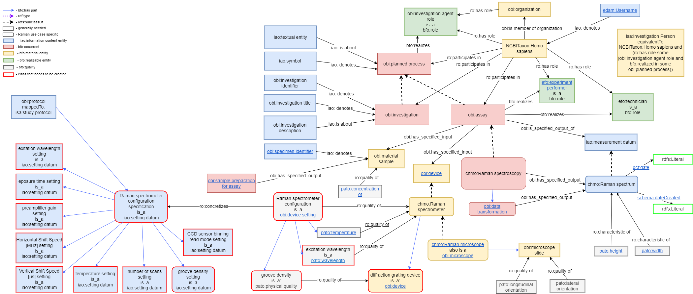

# Development Approach

Following an incremental development approach, we are first going to focus on adding the needed terms for the domain of Raman spectroscopy before coming to infrared spectroscopy. 

Here you can see the first draft of VISPRO's terminology box that focuses on Raman spectroscopy and which tries to demonstrate the modular embedding of VISPRO within the context of already existing onntology classes and relations. The identified needed new terms, depicted here with a red border, were derived from a Raman spectrometer output. 

What is needed next are iterative reviews of this draft by domain experts to ensure that the competency questions of VISPRO can be answered.

## TSV template based development
To enable an easier participation of domain experts, who often times have no or only little background in the development of ontologies and the tools needed for this, we are using a [TSV template](https://github.com/NFDI4Chem/VibrationalSpectroscopyOntology/blob/main/src/templates/vispro_terms.tsv) to define new classes.
As VISPRO is still at a very early stage, we need to get more domain experts involved in helping us to define the needed classes. 

## Proposed contribution workflow
The development of VISPRO is aimed at being as open as possible to allow a broad range of contributions from stakeholders with different backgrounds. The basic idea is to have everything needed within the GitHub repository and to use the ODK based GitHub workflows (e.g. issues & pull requests) to propose and discuss any changes. This means that design patterns and decision will have to be documented here as early as possible.

What we will need to establish is a team of domain experts that are frequently contributing and of whom some can serve as reviewers of open pull requests to assure a high quality. We envision to have regular calls in which open issues and pull request can be discussed alongside the overall organization of the VISPRO development. 

For a more detailed *how-to* on how to contribute please read [this](contributing.md).

