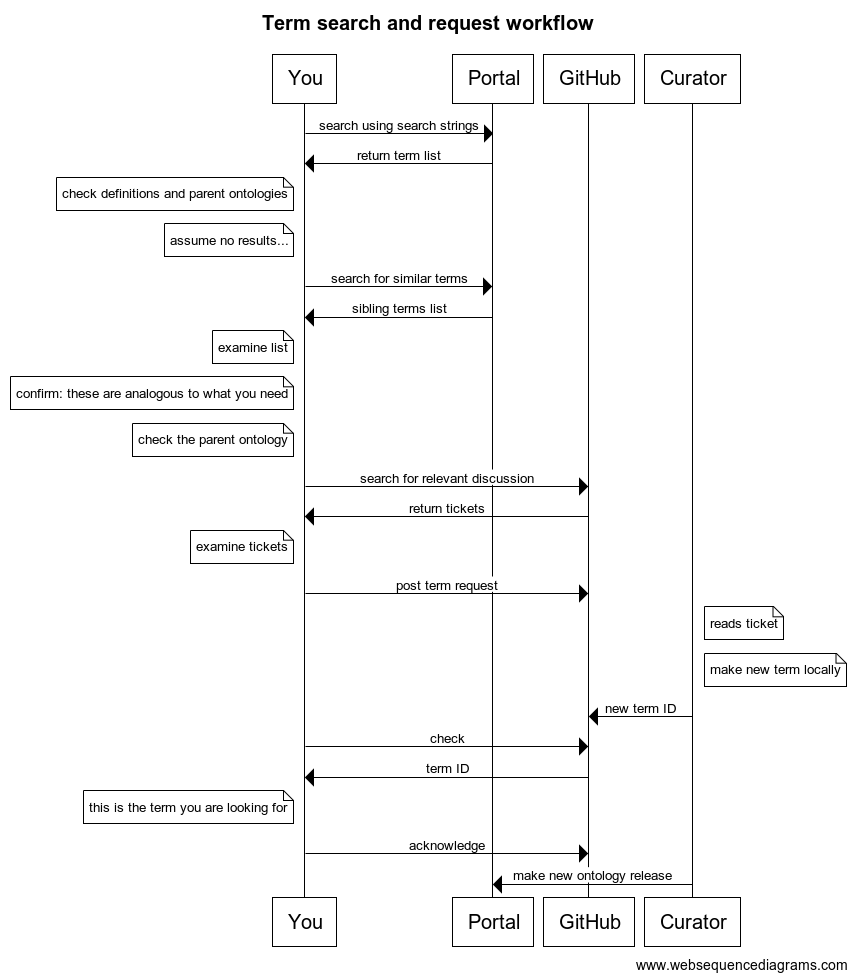

# Adding Terms to VIBSO

Following best practices in ontology development, we are reusing already existing terms from external ontologies whenever possible. This means that before requesting a new term in VIBSO, contributors are expected to research whether the term in question does not already exist in a compatible external ontology using look up portal, such as the [NFDI4Chem Terminology Service](https://terminology.nfdi4chem.de/ts/indexhttps://terminology.nfdi4chem.de/ts/index) or EBI's [OLS](https://www.ebi.ac.uk/ols/index).

Chris Mungall wrote a really helpful blog post on "[How to select and request terms from ontologies](https://douroucouli.wordpress.com/2021/07/03/how-select-and-request-terms-from-ontologies/)". The gist of it is represented in the below graphic taken from it:

## Importing terms
Whenever you identify a term missing in VIBSO and you have found a suitable candidate within an existing ontology, please feel free to open a [new blank issue](https://github.com/NFDI4Chem/VibrationalSpectroscopyOntology/issues/new) with a short but precise title (e.g. import OBI:microscope) and an explanation why you think this term should be imported into VIBSO with regard to its scope. We can thus discuss in the comment section of the issue, whether this term really is a good fit to be imported or why it might not be.

Once it is decided to be needed, a pull request (PR) can be made to include it in the imports. For this it needs either be added in one of the existing text files where such term imports get declared (see [/src/ontology/imports](https://github.com/NFDI4Chem/VibrationalSpectroscopyOntology/tree/main/src/ontology/imports)) and from which the OWL import modules are build automatically, according to the standard import workflow documented in [here](odk-workflows/UpdateImports.md). If the term is from an ontology that is not yet being used as an import module in ViSBO the [managing imports workflow](odk-workflows/RepoManagement.md#managing-imports) needs to be triggered.

## New Term Requests
When you've identified a term that is needed within the scope of VIBSO and which is not yet defined in an existing compatible ontology, please file a [new term request (NRT) issue](https://github.com/NFDI4Chem/VibrationalSpectroscopyOntology/issues/new?assignees=&labels=New+Term+Request&template=new-term-request-issue-template.md&title=%5BNTR%5D).
 This issue should then be used to engage the community in discussing the label, definition, position in the hierarchy as well as possible axiomatization. Once the discussion has reached a consensus, someone from the VIBSO team, will have to make a pull request in which the discussed changes to VISPRO will be implemented and can be reviewed. 

## Adding New Terms to the TSV Template

Once a NTR is ready to be implemented in a PR, all you need to do is editing the [vispro_terms.tsv template](https://github.com/NFDI4Chem/VibrationalSpectroscopyOntology/blob/main/src/templates/vispro_terms.tsv). For an explanation of the TSV columns, go [here](development_approach.md#explanation-of-the-tsv-template-columns).

## Ontology editing: principles and best practices

For more information on best practices in ontology editing, here are some really good links:

* [OBO Foundry Principles](https://obofoundry.org/principles/fp-000-summary.html) 
* [OBOOK](https://oboacademy.github.io/obook/)